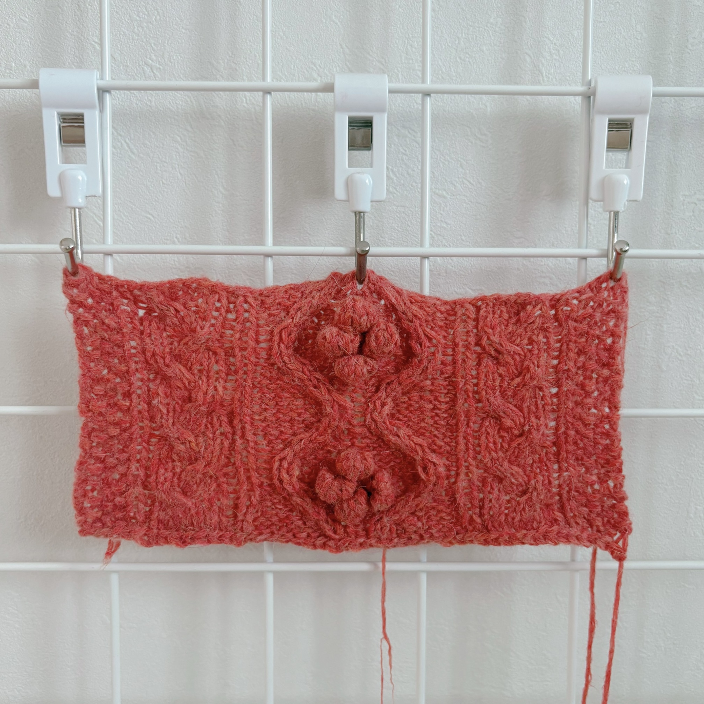
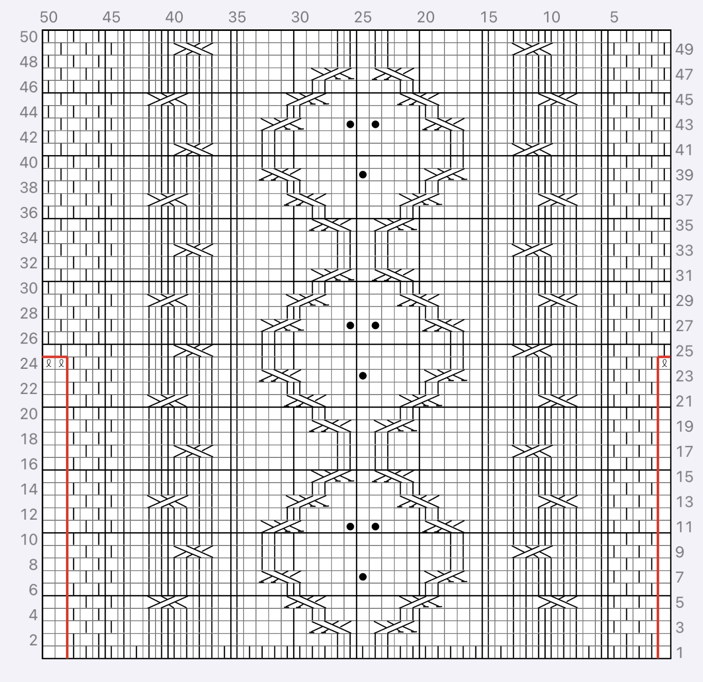
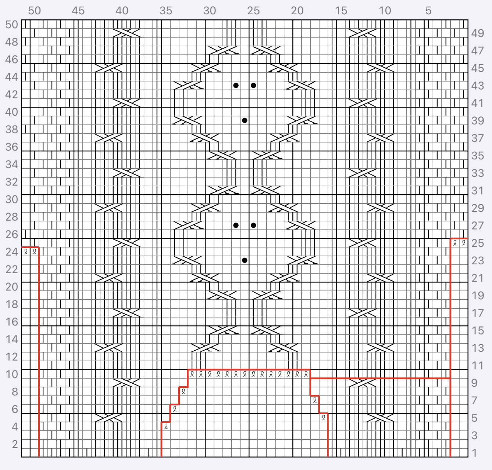

※ 해당 이미지는 메리노앙고라10이 아닌 바늘이야기의 어텀앙고라로 우선 작업해 둔 스와치입니다. 이미지 교체 예정이니 무늬만 참조해 주세요.

> 포인세티아 풀오버

# 원작 정보

* **바늘**: 3mm, 2.5mm 대바늘
* **실**: Bouclelaine Mérinos Angora10 피망컬러 
* **게이지**: (측정 필요)

# 기본 패턴
## 뒷판

## 앞판

1반복무늬 = 47코 16단

* 동그란 무늬는 바늘비우기가 아니라 5코 팝콘뜨기입니다.

# 소매

21코 (마지막 1코는 소매산 꼭대기) / 20코 이렇게 41코 주워 줍니다.