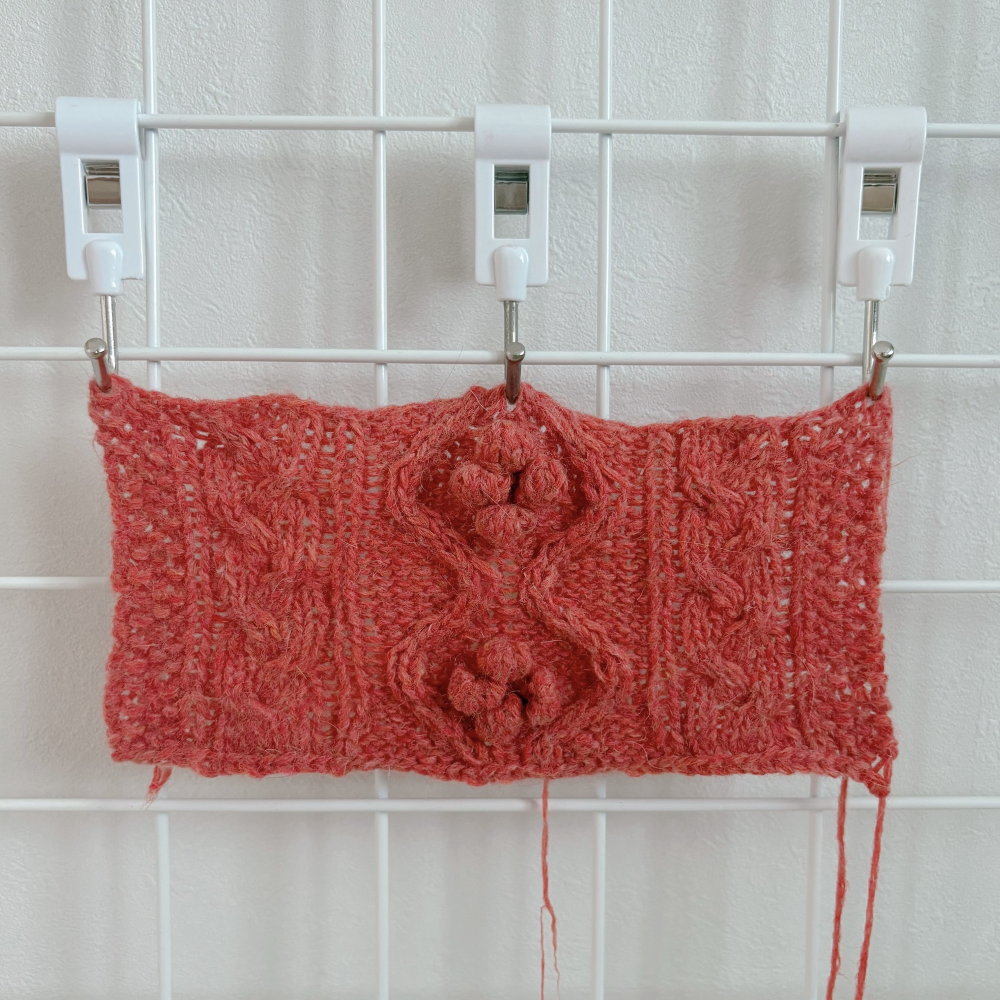
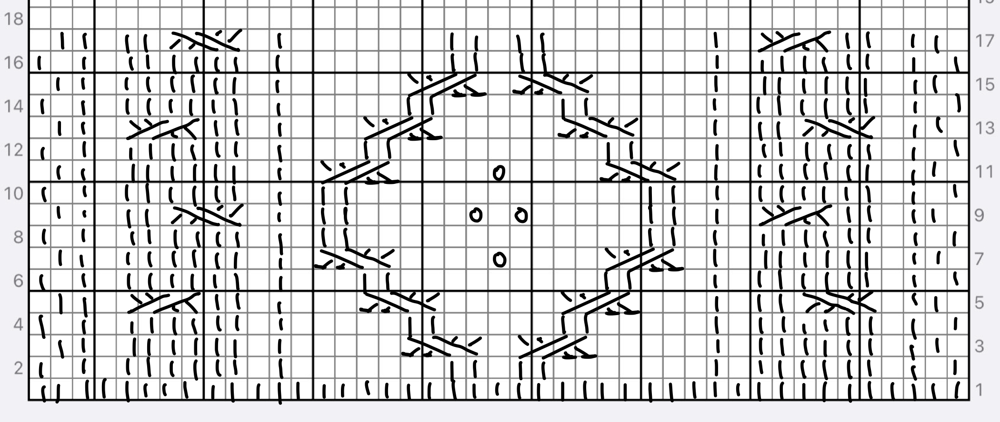

※ 해당 이미지는 메리노앙고라10이 아닌 바늘이야기의 어텀앙고라로 우선 작업해 둔 스와치입니다. 이미지 교체 예정이니 무늬만 참조해 주세요.

> 포인세티아 풀오버

# 원작 정보

* **바늘**: 3mm 대바늘
* **실**: Bouclelaine Mérinos Angora10 피망컬러
* **게이지**: (측정 필요)

# 기본 패턴

1반복무늬 = 47코 16단

* 그림에서는 43코이지만 앞뒤로 멍석무늬 2코씩을 더해 **47코**로 작업합니다.
* 동그란 무늬는 바늘비우기가 아니라 5코 팝콘뜨기입니다.