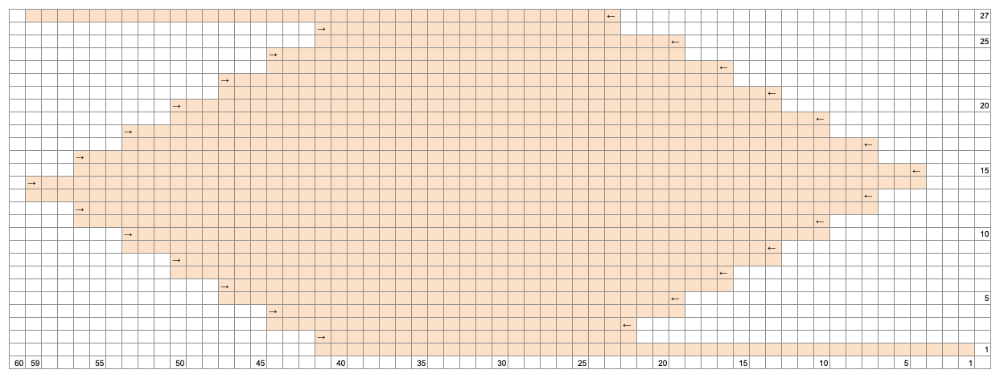
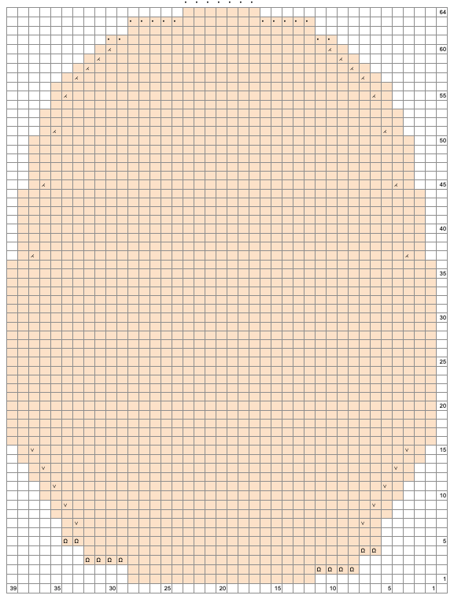

# 기본정보
대바늘로 뜨는 실제 크기의 커다란 인형입니다. 아메아미 디폴트 인형의 스핀오프로 제작되었습니다. 실제 크기인만큼 기성복이 호환됩니다.
- **바늘**: 2.5mm 대바늘
- **실**: 알리익스프레스의 [작은 퍼프 실](https://ko.aliexpress.com/item/1005006330566333.html) 3번 색상 4합 15볼 미만
- **게이지**: 메리야스뜨기 27코 43단
- **사용된 기법**: 저먼 숏 로우, k2tog, skpo, kfp, m1r, m1l
- **부자재**: 알리익스프레스의 [인형 뼈대](https://ko.aliexpress.com/item/4001121738838.html) 46cm 3개, 12mm 나사(와셔)눈 1쌍

# 용어 설명

- `turn`: 저먼 숏 로우 방식으로 되돌아뜨기 합니다. 마지막으로 떴던 코를 안뜨기 방향으로 왼쪽 바늘에 옮긴 뒤, 편물을 돌려 실을 바늘 뒤로 돌려 뜨기 시작합니다.

# 바디 구조

## 1. 뒷판 경사뜨기

- **1단**: 60코 잡기
- **2단**: 16코 남기고 안뜨기, `turn`
- **3단**: 16코 남기고 겉뜨기, `turn`
- **4단**: 12코 남기고 안뜨기, `turn`
- **5단**: 12코 남기고 겉뜨기, `turn`
- **6단**: 8코 남기고 안뜨기, `turn`
- **7단**: 8코 남기고 겉뜨기, `turn`
- **8단**: 4코 남기고 안뜨기, `turn`
- **9단**: 4코 남기고 겉뜨기, `turn`
- **10단**: 모두 안뜨기
- **11단**: 모두 겉뜨기

## 2. 뒷판 평단뜨기

뒷목에서 5cm 될 때까지 메리야스뜨기

- **1단**: 2코, m1l, 2코 남기고 겉뜨기, m1r, 2코 겉뜨기
- **2단**: 모두 안뜨기

1-2단을 2번 반복, 1단을 한 번 더 뜨고 앞판으로 넘어갑니다. 실은 끊지 않아도 되지만 편물의 모양이 찌그러지지 않도록 조금 여유있게 남겨 둡니다.

## 3. 오른 앞판 경사뜨기

- **1단**: 뒷판의 오른쪽 끝에서 16코 줍기
- **2단**: 안뜨기 4, `turn`
- **3단**: 모두 겉뜨기
- **4단**: 안뜨기 8, `turn`
- **5단**: 모두 겉뜨기
- **6단**: 안뜨기 12, `turn`
- **7단**: 모두 겉뜨기
- **8단**: 모두 안뜨기
- **9단**: 모두 겉뜨기
- **10단**: 모두 안뜨기
- **11단**: 2코 남기고 겉뜨기, m1r, 겉뜨기 2
- **12단**: 모두 안뜨기
- **13단**: 2코 남기고 겉뜨기, m1r, 겉뜨기 2

## 4. 왼쪽 앞판 경사뜨기

- **1단**: 앞판의 왼쪽 16코 되는 지점부터 끝까지 16코 줍기
- **2단**: 모두 안뜨기
- **3단**: 겉뜨기 4, `turn`
- **4단**: 끝까지 안뜨기
- **5단**: 겉뜨기 8, `turn`
- **6단**: 끝까지 안뜨기
- **7단**: 겉뜨기 12, `turn`
- **8단**: 끝까지 안뜨기
- **9단**: 모두 겉뜨기
- **10단**: 모두 안뜨기
- **11단**: 겉뜨기 2, m1l, 끝까지 겉뜨기
- **12단**: 모두 안뜨기
- **13단**: 겉뜨기 2, m1l, 끝까지 겉뜨기
- **14단**: 모두 안뜨기, 감아코 24코, 오른쪽 앞판까지 안뜨기
- **15단**: 모두 겉뜨기

## 5. 앞판 평단뜨기

어깨부터 4cm 될 때까지 메리야스뜨기

- **1단**: 겉뜨기 2, m1l, 2코 남기고 겉뜨기, m1r, 겉뜨기 2
- **2단**: 모두 안뜨기

1-2단을 2번 반복, 1단을 한 번 더 뜹니다. 즉, 총 세 번의 늘림단을 지나는 것입니다.

## 6. 몸통 메리야스뜨기

뒷판과 앞판에 해당하는 코를 각각 분리하여 매직루프로 작업합니다.

- **1단**: 감아코 4, 뒷판에 해당하는 코를 모두 겉뜨기, 감아코 4, 앞판에 해당하는 코를 모두 겉뜨기
- **2단**: 모두 겉뜨기
- **3단**: 뒷판에 해당하는 코를 모두 겉뜨기, 앞판으로 넘어와서 겉뜨기 10, m1l, 10코 남기고 겉뜨기, m1l, 겉뜨기 10
- **4단**: 모두 겉뜨기
- **5단**: 뒷판에 해당하는 코를 모두 겉뜨기, 앞판으로 넘어와서 겉뜨기 15, m1l, 15코 남기고 겉뜨기, m1l, 겉뜨기 15

이후, 감아코 부분부터 2cm 되는 지점까지 모두 겉뜨기로 작업합니다. 이 구간에서는, 단의 시작과 끝을 앞판이 끝나고 뒷판이 시작하는 지점으로 합니다.

- **1단**: 뒷판에 해당하는 코를 모두 겉뜨기, 앞판으로 넘어와서 10코 남기고 겉뜨기, `turn`
- **2단**: 앞판에 해당하는 코를 10코 남기고 (바늘 끝까지 10코 남기고) 안뜨기, `turn`
- **3단**: 앞판에 해당하는 코를 5코 남기고 (바늘 끝까지 5코 남기고) 겉뜨기, `turn`
- **4단**: 앞판에 해당하는 코를 5코 남기고 (바늘 끝까지 5코 남기고) 안뜨기, `turn`

5단부터는, 뒷목부터의 길이가 총 27cm가 될 때까지 모두 겉뜨기로 작업합니다. 27cm 지점까지 거의 다 떴을 때, 앞뒷판의 중심부(앞판은 37코, 뒷판은 35코)에 마커를 걸어줍니다. 상술했듯, 앞판이 끝나고 뒷판이 시작하는 지점까지 작업합니다. 

## 7. 골반 늘림단

이후, 뒷판의 중심부에 해당하는 마커까지 겉뜨기 해줍니다. (겉뜨기 35) 그리고 마커부터 마커까지를 한쪽 바늘에, 나머지를 다른 쪽 바늘에 걸어줍니다. 앞으로는 **뒷판의 중심부**에서 단을 시작합니다.

처음에는 매직루프로밖에 뜰 수 없겠지만, 계속해서 코를 늘려 가므로 중간 어딘가쯤부터는 원통뜨기가 가능해질 것입니다. 그 때는 마커를 다시 끼워야 합니다.

- **1단**: kfb, 마커 1코 전까지 겉뜨기, kfb, 마커 넘기기, kfb, 마커 1코 전까지 겉뜨기, kfb
- **2단-6단**: 모두 겉뜨기

1단부터 6단을 15번 반복한 뒤, 1단을 한번 더 뜹니다. 즉 총 16번의 늘림단을 거칩니다. 이 지점에서 전체 콧수는 **208코**가 됩니다.

## 8. 오른 엉덩이 경사뜨기

그림을 함께 참고해 봅시다.

- **1단**: 겉뜨기 41, `turn`
- **2단**: 안뜨기 19, `turn`
- **3단**: 더블 스티치 까지 겉뜨기, 겉뜨기 3, `turn`
- **4단**: 더블 스티치 까지 안뜨기, 안뜨기 3, `turn`

더블 스티치는 코들이 뭉쳐 있기 때문에 쉽게 구분할 수 있습니다.

이후 3-4단을 마커 3코 전에서 `turn` 해야 할 때까지 반복, 총 14단의 turn을 했을 것이고, 안뜨기 단에서 `turn` 한 상태로 끝납니다. 마커부터 가장 먼 더블 스티치 다음 코(60코째) 에 스티치 마커를 걸어 둡니다.

- **1단**: 더블 스티치 포함 3코 전까지 겉뜨기, `turn`
- **2단**: 더블 스티치 포함 3코 전까지 안뜨기, `turn`

이후 1-2단을 더블 스티치가 양쪽에 7개씩 있을 때까지 반복합니다. 역시 안뜨기 단에서 `turn` 한 상태로 끝납니다.

## 9. 왼쪽 엉덩이 경사뜨기

위의 그림과 시작 지점을 제외하고는 동일한 구조를 가지고 있습니다.

- **1단**: 마커까지 21코 남은 상태까지 겉뜨기, `turn`
- **2단**: 더블 스티치 까지 안뜨기, 안뜨기 3, `turn`
- **3단**: 더블 스티치 까지 겉뜨기, 겉뜨기 3, `turn`
- **4단**: 더블 스티치 까지 안뜨기, 안뜨기 3, `turn`

이후 3-4단을 마커 3코 전에서 `turn` 해야 할 때까지 반복, 안뜨기 단에서 `turn` 한 상태로 끝납니다. 이번에는 `turn` 하기 전 바로 다음 코에 스티치 마커를 걸어 둡니다.

- **1단**: 더블 스티치 포함 3코 전까지 겉뜨기, `turn`
- **2단**: 더블 스티치 포함 3코 전까지 안뜨기, `turn`

이후 3-4단을 더블 스티치가 양쪽에 7개씩 있을 때까지 반복합니다. 역시 안뜨기 단에서 `turn` 한 상태로 끝납니다.

양쪽에 걸린 스티치 마커 사이의 콧수는 118코, 반대쪽 콧수는 90코가 됩니다.

## 10. 넓적다리 메리야스뜨기

- **1단**: 뒷판 중심 마커까지 겉뜨기한 이후, 두번째 만나는 스티치 마커 (두번째로 걸었던 스티치 마커) 까지 겉뜨기
- **2단**: 양쪽 스티치 마커 사이의 코들(118코 부분)을 모두 코막음 합니다. 이후의 코들은 앞판 중심 마커까지 겉뜨기하고, 앞판의 나머지 코들(45코)은 별실에 걸어줍니다. 감아코 2
- **3단**: 이제부터 다시 매직루프에 들어갑니다. 코막음한 부분에서 45코를 줍습니다. 메인 바늘에 걸려 있는 전체 코는 92코. 양쪽 감아코 사이를 중심으로 46코/46코로 분리합니다.

이제 분리한 부분으로부터 5cm 길이만큼 겉뜨기 합니다.

## 11. 넓적다리 경사뜨기

- **1단**: 해당 단이 3코 남을 때까지 겉뜨기, `turn`. 두 바늘에 걸려 있는 코들을 모두 떠야 한 단이라는 것에 주의합니다.
- **2단**: 해당 단이 3코 남을 때까지 안뜨기, `turn`
- **3단**: 더블 스티치 포함 3코 전까지 겉뜨기, `turn`
- **4단**: 더블 스티치 포함 3코 전까지 안뜨기, `turn`

이후 3-4단을 더블 스티치가 양쪽에 10개씩 있을 때까지 반복합니다. 안뜨기 단에서 `turn` 한 상태로 끝납니다.

## 12. 넓적다리 코줄임

- **1-5단**: 모두 겉뜨기
- **6단**: 바늘 끝 3코 전까지 겉뜨기, k2tog, 겉뜨기 1, 바늘 넘기기, 겉뜨기 1, skpo, 바늘 끝까지 겉뜨기

1단부터 6단까지 12번 반복합니다. 10번에서 분리한 부분으로부터 30cm 길이만큼 겉뜨기 합니다.

# 헤드 구조

## 1. 얼굴

아래 그림을 참조하여 얼굴 면적을 뜹니다. 윗부분이 턱, 아랫부분이 이마 쪽입니다.

* Ω: 감아코
* ∨: kfb
* ⋌: k2tog
* ⦁: 코막음

실을 자르지 않고, 둘레에서 총 100코를 줍습니다. 50코씩 각 바늘에 분리해주는데, 이 때 끝실이 나왔던 부분이 얼굴의 정가운데가 아니므로 가운데를 잘 맞춰줍니다. 이 끝부분이 얼굴 아랫부분이며, 턱의 중심이 됩니다.

4cm 길이만큼 겉뜨기합니다.

## 2. 머리 경사뜨기

매직루프로 작업하는 것을 상정하고 설명하겠습니다.

* **1단**: 바늘 끝까지 겉뜨기, 바늘 넘기기, 겉뜨기 25, `turn`
* **2단**: 바늘 끝까지 안뜨기, 바늘 넘기기, 안뜨기 25, `turn`
* **3단**: 바늘 끝까지 겉뜨기, 바늘 넘기기, 더블 스티치 포함 2코 전까지 겉뜨기, `turn`
* **4단**: 바늘 끝까지 안뜨기, 바늘 넘기기, 더블 스티치 포함 2코 전까지 안뜨기, `turn`

이후 3-4단을 더블 스티치가 양쪽에 12개씩 있을 때까지 반복합니다. 안뜨기 단에서 `turn` 한 상태로 끝납니다.

## 3. 머리 코줄임

* **1단**: 모두 겉뜨기
* **2단**: (3코, k2tog) 끝까지 반복: 총 80코

2cm 길이만큼 겉뜨기합니다.

* **1단**: (2코, k2tog) 끝까지 반복: 총 60코

5cm 길이만큼 겉뜨기합니다.

* **1단**: (1코, k2tog) 끝까지 반복: 총 40코